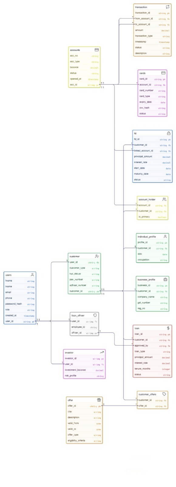

# Digital Banking System – Database Schema

---

---

# BANK

## Entities

* user
* customer

  * individual_profile
  * business_profile
* account
* account_holder
* transaction
* card
* fixed_deposit
* loan
* loan_officer
* investor_profile
* offer

---

# Attributes

---

## user

* user_id (PK)
* fname
* lname
* email
* phone
* password_hash
* role (customer, loan_officer, investor, admin)
* created_at

---

## customer

(Specialization into individual_profile and business_profile)

* customer_id (PK)
* user_id (FK → user.user_id)
* customer_type (individual, business)
* kyc_status
* pan_number
* adhaar_number

---

## individual_profile

* profile_id
* customer_id (FK → customer.customer_id)
* dob
* occupation

---

## business_profile

* business_id (PK)
* customer_id (FK → customer.customer_id)
* company_name
* gst_number
* reg_no

---

## account

* acc_id (PK)
* acc_no (unique)
* acc_type (savings, current, fd, loan)
* balance
* status
* opened_at

---

## account_holder

* account_id (FK → account.acc_id)
* customer_id (FK → customer.customer_id)
* is_primary (boolean)

---

## transaction

* transaction_id (PK)
* from_account_id (FK → account.acc_id)
* to_account_id (FK → account.acc_id)
* amount
* transaction_type (credit, debit, transfer)
* timestamp
* status
* description

---

## card

* card_id
* account_id (FK → account.acc_id)
* card_number
* card_type (debit, credit)
* expiry_date
* cvv_hash
* status

---

## fixed_deposit

* fd_id
* customer_id (FK → customer.customer_id)
* linked_account_id (FK → account.acc_id)
* principal_amount
* interest_rate
* start_date
* maturity_date
* status

---

## loan

* loan_id
* customer_id (FK → customer.customer_id)
* loan_type
* principal_amount
* interest_rate
* tenure_months
* status (pending, approved, rejected, closed)
* approved_by (FK → loan_officer.officer_id)

---

## loan_officer

* officer_id
* user_id (FK → user.user_id)
* employee_id

---

## investor_profile

* investor_id
* user_id (FK → user.user_id)
* investment_balance
* risk_profile

---

## offer

* offer_id
* title
* description
* valid_from
* valid_to
* offer_type (cashback, loan_discount, card_offer)
* eligibility_criteria

---

# Relationships

* Every user is customer (1 to 1)

* Every user is loan_officer (1 to 1)

* Every user is investor (1 to 1)

* Every customer (of type individual) has one individual_profile (1 to 1)

* Every customer (of type business) has one business_profile (1 to 1)

* Multiple customers can hold multiple accounts (n to m)

* One account can have multiple account_holder (1 to n)

* One customer can have multiple account_holder (1 to n)

* One account can initiate many transactions (1 to n)

* One account can receive many transactions (1 to n)

* One account can hold multiple cards (1 to n)

* One customer can open many fixed_deposits (1 to n)

* One account can be linked to multiple fixed_deposits (1 to n)

* One customer can apply for multiple loans (1 to n)

* One loan_officer can approve multiple loans (1 to n)

* Multiple offers can be applied to multiple customers (n to m)