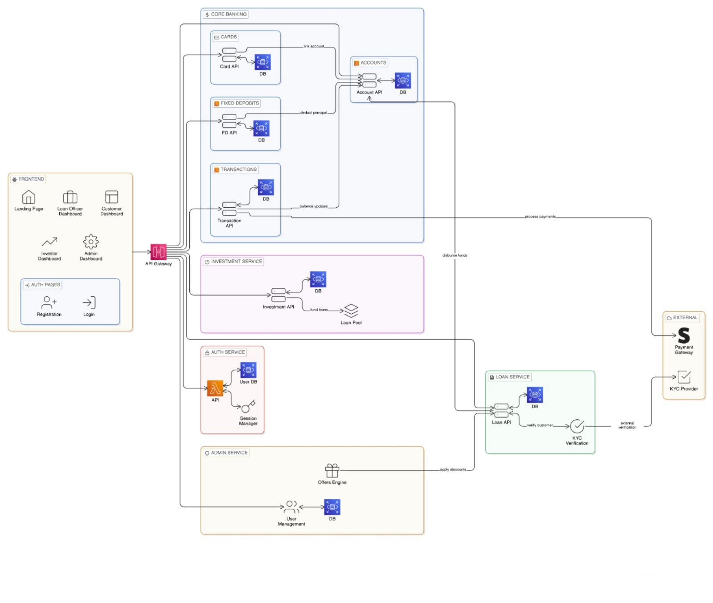

# Digital Banking System – Architecture & Flow Documentation

---

[WIREFRAME 1](https://digialbanking.my.canva.site/)\
[WIREFRAME 2](https://uxpilot.ai/s/51ee7ffe8d5efa45efb9c7606b9568d6)

---

---
`Architecture diagram:`



---

## 1. Application Structure

```
landing-page/

login/

register/
    register-as-customer/
    register-as-loan-officer/
    register-as-investor/

dashboard/
    customer/
        overview/
        accounts/
            view-accounts/
            create-account/
            add-joint-holder/
            close-account/
        transactions/
            transaction-history/
            transaction-details/
        transfer/
        cards/
            apply-card/
            view-cards/
            block-card/
        fixed-deposit/
            create-fd/
            my-fds/
            fd-details/
            close-fd/
        loans/
            apply-loan/
            my-loans/
            loan-details/
        offers/
        profile/
            view-profile/
            edit-profile/
            change-password/

    loan-officer/
        loan-applications/
        approve-loan/
        reject-loan/
        kyc-verification/
        customer-details/

    investor/
        investment-dashboard/
        portfolio/
        returns/
        invest-loan-pool/
        transaction-history/

    admin/
        manage-users/
        manage-offers/
        freeze-account/

logout/
```

---

# 2. System Flow

---

## Registration Flow

### register/

Input:

* fname
* lname
* email (unique check)
* phone
* password (hash before storing)
* choose role

### System Process:

* Check if email already exists
* Hash password
* Insert into `user` table
* Assign role

#### If role = customer:

* Create `customer`

  * customer_type (individual/business)
  * pan_number
  * aadhaar_number
  * kyc_status = pending
* Create `individual_profile` OR `business_profile`
* Redirect to login

#### If role = loan_officer:

* Create `loan_officer` entry
* Assign employee_id
* Redirect to login

#### If role = investor:

* Create `investor_profile`

  * investment_balance = 0
  * risk_profile
* Redirect to login

---

## Login Flow

### login/

* Enter email + password
* Fetch user by email
* Verify password_hash
* Check `user.status = active`
* Check role

Redirect:

* customer → dashboard/customer
* loan_officer → dashboard/loan-officer
* investor → dashboard/investor
* admin → dashboard/admin

---

# Customer Module Flows

---

## Create Account

### dashboard/customer/create-account/

Input:

* acc_type (savings/current)
* initial deposit

System:

* Generate unique acc_no
* Set balance = initial deposit
* status = active
* opened_at = now()
* Insert into `account`
* Create `account_holder` entry
  (account_id, customer_id, is_primary = true)
* Show success message

---

## Add Joint Account Holder

### dashboard/customer/add-account-holder/

Input:

* Select account
* Search customer by email or account_no

System Check:

* account.status = active
* customer exists
* not already holder

Process:

* Insert into `account_holder`

  * is_primary = false

---

## Transfer Money

### dashboard/customer/transfer/

Input:

* from_account
* to_account
* amount

System Checks:

* from_account exists
* to_account exists
* both accounts status = active
* from_account balance ≥ amount
* amount > 0

Process (atomic transaction):

* Deduct amount from from_account
* Add amount to to_account
* Insert into `transaction`

  * transaction_type = transfer
  * status = success
  * timestamp = now()

If failure:

* Rollback
* Insert transaction with status = failed
* Show error message

---

## View Transactions

### dashboard/customer/transactions/

* Fetch transactions where:

  * from_account_id IN user accounts
  * OR to_account_id IN user accounts
* Order by timestamp DESC
* Show transaction details on click

---

## Apply Card

### dashboard/customer/apply-card/

Input:

* Select account

System Check:

* account.status = active
* card limit not exceeded

Process:

* Generate unique card_number
* Generate random cvv
* Hash cvv
* expiry_date = +5 years
* status = active
* Insert into `card`

---

## Fixed Deposit

### dashboard/customer/create-fd/

Input:

* linked_account
* principal_amount
* tenure

System Check:

* linked_account.status = active
* linked_account.balance ≥ principal_amount

Process:

* Calculate interest_rate
* Calculate maturity_date
* Deduct principal from linked_account
* Insert into `fixed_deposit`

  * status = active

---

## Apply Loan

### dashboard/customer/apply-loan/

Input:

* loan_type
* principal_amount
* tenure_months

System Check:

* kyc_status = verified
* no defaulted loans

Process:

* Insert into `loan`

  * status = pending
  * approved_by = null
  * applied_at = now()

---

## Loan Repayment

### dashboard/customer/loan-payment/

Input:

* select loan
* repayment amount

System:

* Deduct from account
* Update outstanding principal
* Insert transaction (debit)
* If principal fully paid:

  * status = closed

---

## Close Account

### dashboard/customer/close-account/

Checks:

* balance = 0
* no active loans
* no active fixed deposits

If valid:

* Set account.status = closed

If invalid:

* Show reason

---

## Offers

### dashboard/customer/offers/

* Fetch offers where:

  * valid_from ≤ today ≤ valid_to
* Check eligibility_criteria

If eligible:

* Apply discount during:

  * loan interest calculation
  * transaction cashback
  * card usage

---

# Loan Officer Module

---

## Loan Applications

### dashboard/loan-officer/loan-applications/

* View loans where status = pending

Officer Actions:

### APPROVE:

* Set status = approved
* Set approved_by = officer_id
* Disburse loan:

  * Credit principal_amount to primary account
  * Insert transaction (credit)

### REJECT:

* Set status = rejected

---

## KYC Verification

### loan-officer/kyc-verification/

* View customers where kyc_status = pending

Officer:

* Verify PAN + Aadhaar
* Update kyc_status = verified
  OR
* Update kyc_status = rejected

---

# Investor Module

---

## Investment Dashboard

### dashboard/investor/

* View investment_balance
* View active loan pool

Invest Process:

* Enter investment amount

System Check:

* investment_balance ≥ amount

Process:

* Deduct investment_balance
* Associate investor with loan
* Returns credited periodically
* Update investment_balance

---

# Admin Module

---

## dashboard/admin/

* Manage users

  * activate/deactivate
* Manage offers

  * create
  * update
  * expire
* View reports

  * total accounts
  * total loans
  * total transactions
* Freeze account

  * set status = frozen

---

# Logout Flow

### logout/

* Destroy session
* Redirect to landing-page

---

# Architecture Overview

### Presentation Layer

* Web pages and dashboards

### Application Layer

* Business logic
* Role-based access control
* Validation
* Loan and transaction processing

### Data Layer

* Relational database
* Foreign keys
* Atomic transactions
* Status-based lifecycle control